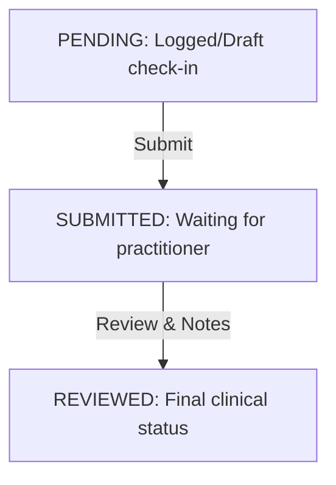

# Frontend Check-Ins Handover Guide

This document outlines the UI flows, status lifecycles, and API utilization suggestions for building the Client Check-ins frontend features.

---

## 1. UI Layout & View Structure

The check-ins system requires three main UI components:

1. **Client Check-in History List (Client Details page sub-tab)**:
   - A timeline view of past check-ins for the selected client.
   - Displays `checkInDate`, `status` badge, and physical progress card indicators (e.g. Weight: `82.5 kg` with a green delta pill showing `↓ -1.3 kg`).
   - Action buttons: "Log Check-in", "Review", "Edit", and "Delete".

2. **Practitioner Dashboard Queue ("Check-ins Review" or "Inbox")**:
   - Uses `GET /api/v1/check-ins` with filters `status=SUBMITTED` or `requiresFollowUp=true`.
   - Displays check-ins submitted by clients that need dietitian review.
   - Quick-toggle filters for: "All", "Pending Review", and "Requires Follow-up".

3. **Check-in Log / Review Modal or Sheet Form**:
   - Tabbed or stepped form for:
     - **Physical Metrics**: Weight, Waist, Hip, Chest, Arm, Thigh.
     - **Lifestyle Compliance**: Water intake (L), Sleep hours, Exercise days.
     - **Self-Assessments**: 1-5 rating scales for Energy, Stress, Mood, and Plan Adherence.
     - **Practitioner Section (only visible to practitioner)**: Practitioner Notes textarea, "Requires Follow-up" checkbox, and a "Mark as Reviewed" action.

---

## 2. Check-in Status Flow

- **PENDING**: Used if a client or practitioner saves a partial log without submitting.
- **SUBMITTED**: Ready for clinical review. Highlighted in red/yellow badges in review queues.
- **REVIEWED**: Checked by practitioner. Terminal state. Status cannot be downgraded back to `PENDING` or `SUBMITTED`, but metrics remain editable.

---

## 3. Dynamic Delta Indicators

The API dynamically calculates deltas based on the previous check-in (by `checkInDate`).
Use these to render trend cards:
- `weightChange`: Renders `+X.X kg` (red/warning for gain, or green/info for loss depending on client goals) or `-X.X kg`.
- `waistChange`, `hipChange`, `chestChange`, `armChange`, `thighChange`: Renders measurements trend lines.

---

## 4. Derived Metric Fields (KPI Cards)

To populate the top KPIs on the Progress tab or Client Overview, compute these from the check-in list:
- **`latestWeight`**: The `weightKg` value from the most recent check-in.
- **`weightTrend`**: Sum/average of the last 3-5 `weightChange` deltas.
- **`lastCheckInDate`**: The `checkInDate` of the first check-in in the desc list.
- **`checkInCount`**: Total number of logged check-ins (`pagination.total`).
