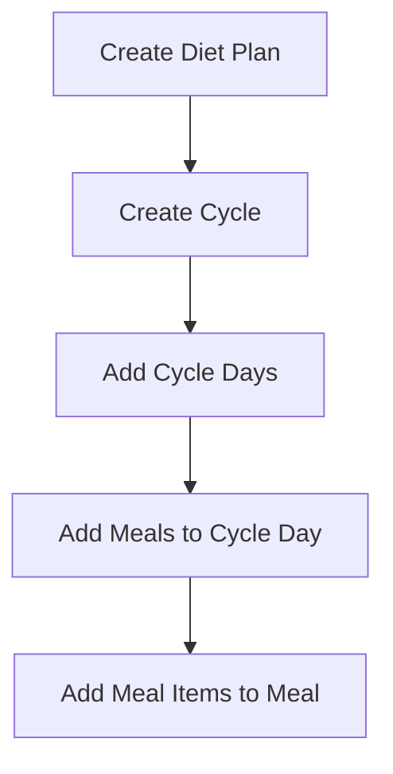

# Frontend Integration Guide: Cycle-Based Meal Plans & Calendar Engine

This document provides frontend developers with the patterns, endpoints, and workflows to integrate Cycle-Based Plans and the Calendar Preview engine.

---

## What is a Cycle-Based Diet Plan?

Instead of a static list of meals that repeats every single day indefinitely, cycle-based plans repeat a sequence of custom days (e.g. Day A, Day B, Day C) inside a cycle. Practitioners can assign:
- Day A (Training Day - High Calories / High Carbs)
- Day B (Rest Day - Low Calories / High Fat)

The system automatically calculates which day resolves on any calendar date starting from the plan's `cycleStartDate`.

---

## 🔌 Backward Compatibility (Zero Refactoring Required)

If your client-facing application simply fetches a diet plan to render a list of meals, **you do not need to rewrite your views**.

### Option 1: Query Diet Plan Details by Date
When fetching a diet plan, pass a `date` parameter:
```http
GET /api/v1/diet-plans/:id?date=2026-06-05
```
The server will automatically resolve the active cycle day for that date, replace the root `meals` array with that day's meals, and provide a `resolvedCycleDay` metadata object.

### Option 2: Fetch Active Diet Plan for Date
```http
GET /api/v1/clients/:clientId/diet-plan-for-date?date=2026-06-05
```
This returns the active plan with the meals mapped for that specific date.

---

## 🛠️ The Builder Workflow

To build a cycle-based plan from the practitioner interface:



### 1. Create a Cycle
```http
POST /api/v1/diet-plans/:id/cycles
Content-Type: application/json

{
  "name": "Initial 4-Day Split",
  "startDay": 1
}
```

### 2. Add Days to the Cycle
```http
POST /api/v1/cycles/:cycleId/days
Content-Type: application/json

{
  "dayNumber": 1,
  "dayLabel": "Upper Push (Day A)",
  "plannedCalories": 2800,
  "plannedProtein": 180,
  "plannedCarbs": 320,
  "plannedFat": 80
}
```

### 3. Add Meals to a Cycle Day
To associate a meal with a specific cycle day, pass the `cycleDayId` in the body when creating a meal:
```http
POST /api/v1/meals
Content-Type: application/json

{
  "dietPlanId": "cuid-plan-id",
  "name": "BREAKFAST",
  "mealOrder": 1,
  "mealTime": "08:00",
  "cycleDayId": "cuid-cycle-day-id"
}
```

---

## 📊 Calendar Preview

To render a monthly preview calendar showing which day applies on each date:
```http
GET /api/v1/diet-plans/:id/calendar-preview?limit=30
```
**Returns**:
```json
[
  { "date": "2026-06-01", "dayLabel": "Upper Push (Day A)" },
  { "date": "2026-06-02", "dayLabel": "Lower Pull (Day B)" },
  { "date": "2026-06-03", "dayLabel": "Rest Day (Day C)" }
]
```
Use this array to populate the dots/labels on the frontend calendar component.
