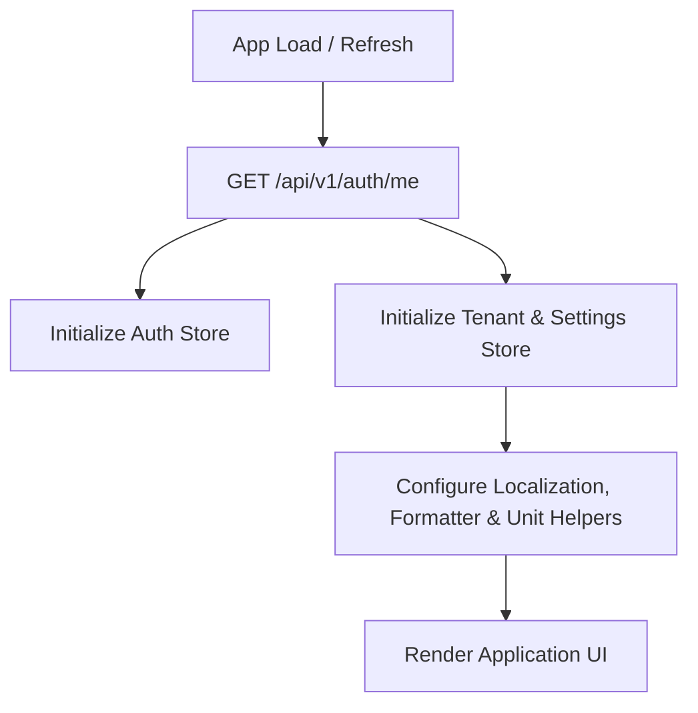

# Frontend Handover: Tenant Settings, Localization & Global Food Library

This document outlines the API response structures, client-side hydration flow, formatting rules, and component integration strategies for the Tenant Settings & Global Food Library features.

---

## 1. Auth Bootstrap

The authenticated user profile and bootstrap payload has been modified to return unified `user` and `tenant` structures at the top-level. This structure is identical across all authentication-related endpoints:
- `POST /api/v1/auth/login`
- `POST /api/v1/auth/register`
- `POST /api/v1/auth/refresh`
- `GET /api/v1/auth/me`

### Response Payload Structure
```json
{
  "success": true,
  "message": "Authenticated successfully",
  "data": {
    "user": {
      "id": "cmpqjlge10017oh98h8ngymbm",
      "email": "practitioner@example.com",
      "firstName": "John",
      "lastName": "Doe",
      "fullName": "John Doe",
      "role": "OWNER",
      "status": "ACTIVE",
      "avatarUrl": null,
      "createdAt": "2026-05-30T10:00:00.000Z"
    },
    "tenant": {
      "id": "cmpqjlgf10018oh98h8ngymbm",
      "name": "NutriFit Wellness",
      "slug": "nutrifit",
      "countryCode": "IN",
      "timezone": "Asia/Kolkata",
      "locale": "en-IN",
      "currencyCode": "INR",
      "measurementSystem": "METRIC",
      "updatedAt": "2026-05-30T15:26:08.420Z",
      "features": {
        "multiBranch": false,
        "clientPortal": false,
        "mobileApp": false,
        "whiteLabel": false
      }
    },
    "accessToken": "eyJhbGciOiJIUzI1NiIsInR5cCI6IkpXVC..."
  }
}
```

---

## 2. Frontend Hydration Flow

To prevent UI flashing and layout shifts due to localized dates, currencies, and unit labels, the application startup hydration flow must follow this deterministic sequence:



### Flow Checklist:
1. **Auth Store**: Persist user identity, role, and tokens.
2. **Tenant Store**: Store localization fields (`timezone`, `locale`, `currencyCode`, `measurementSystem`) globally.
3. **Formatter Store**: Initialize date/time, weight/height converters, and currency formatting helpers using the current tenant's context.
4. **Render App**: Proceed to display dashboards and features with local variables.

---

## 3. Localization Options API

Provides the client list options for dropdown selectors in the admin settings dashboard. To optimize performance, this endpoint serves records cached in-memory on the server.

* **URL**: `/api/v1/settings/localization-options`
* **Method**: `GET`
* **Headers**: `Authorization: Bearer <accessToken>`
* **Success Response (200 OK)**:
```json
{
  "success": true,
  "message": "Localization options retrieved successfully",
  "data": {
    "countries": [
      { "code": "IN", "name": "India" },
      { "code": "US", "name": "United States" }
      // ... (sorted alphabetically by name)
    ],
    "currencies": [
      { "code": "INR", "name": "Indian Rupee" },
      { "code": "USD", "name": "US Dollar" }
      // ... (sorted alphabetically by code)
    ],
    "timezones": [
      { "name": "Asia/Kolkata", "utcOffset": 330, "utcOffsetStr": "+05:30" },
      { "name": "UTC", "utcOffset": 0, "utcOffsetStr": "+00:00" }
      // ... (sorted alphabetically by name)
    ],
    "locales": [
      { "code": "en-US", "name": "English (United States)" },
      { "code": "en-IN", "name": "English (India)" },
      { "code": "es-ES", "name": "Español (España)" }
      // ...
    ]
  }
}
```

---

## 4. Tenant Settings API

Used by administrative roles to retrieve or edit corporate configuration preferences.

### GET /api/v1/settings/tenant
* **Method**: `GET`
* **Headers**: `Authorization: Bearer <accessToken>`
* **Success Response (200 OK)**:
```json
{
  "success": true,
  "message": "Tenant settings retrieved successfully",
  "data": {
    "countryCode": "IN",
    "timezone": "Asia/Kolkata",
    "locale": "en-IN",
    "currencyCode": "INR",
    "measurementSystem": "METRIC",
    "updatedAt": "2026-05-30T15:26:08.420Z"
  }
}
```

### PATCH /api/v1/settings/tenant
* **Method**: `PATCH`
* **Headers**:
  * `Authorization: Bearer <accessToken>`
  * `Content-Type: application/json`
* **Request Body**:
```json
{
  "countryCode": "IN",
  "timezone": "Asia/Kolkata",
  "locale": "en-IN",
  "currencyCode": "INR",
  "measurementSystem": "METRIC"
}
```
* **Success Response (200 OK)**: Returns the updated settings and new `updatedAt` value (identical format to the GET endpoint).

---

## 5. Frontend UI Implementation Guide

### Droplist & Form Element Mapping
Use the properties from `GET /api/v1/settings/localization-options` to populate dropdown controls inside the settings page:
1. **Country Dropdown**: Use `countries` array. Map `code` to the value, and `name` to the label. If `countryCode` is `null` in settings, default selector to empty.
2. **Timezone Dropdown**: Use `timezones` array. Map `name` to value, and label format: `"${name} (GMT ${utcOffsetStr})"` (e.g., `Asia/Kolkata (GMT +05:30)`).
3. **Currency Dropdown**: Use `currencies` array. Map `code` to value, and `"${code} - ${name}"` to the label (e.g., `INR - Indian Rupee`).
4. **Locale Dropdown**: Use `locales` array. Map `code` to value, and `name` to the label.
5. **Measurement System Selector**: Radio-group or select buttons toggling between `METRIC` and `IMPERIAL`.

---

## 6. Global Food Library

The food library has transitioned to a shared architecture enabling standard system-wide items alongside tenant customized listings.

### Structure & Search Rules
- **System Foods (`isSystem: true`)**: Shared database records. Accessible by all tenants. Read-only for practitioners.
- **Tenant Foods (`isSystem: false`)**: Customized/imported foods created by the tenant. Private to this tenant.
- **Backwards Compatibility**: The API continues to return `sourceType: "SYSTEM"` or `sourceType: "CUSTOM"`.
- **Search Behavior**:
  - `GET /api/v1/food-library` queries search across both global system foods and the current tenant's custom foods.
  - If a tenant creates a custom food with the exact same name as a system food, the search query prioritises the custom tenant food (`sourceType: "CUSTOM"`).
  - Practitioners cannot update or delete system foods. Attempts will return `404 Not Found` or `403 Forbidden`.

---

## 7. Locale Formatting Guide

Always use standard native JavaScript browser APIs (`Intl`) to format dates, currency, and numbers. Detailed standard examples can be found in the [locale-formatting-guide.md](file:///c:/Users/Dinesh%20Bharathi/Desktop/nutri-diet/backend/docs/locale-formatting-guide.md) file.

### Summary Strategy

#### Date Formatting
Use the tenant's `locale` and `timezone` to format dates:
```javascript
new Intl.DateTimeFormat(locale, {
  dateStyle: 'medium',
  timeZone: timezone,
}).format(new Date(dateString));
```

#### Currency Formatting
Use the tenant's `locale` and `currencyCode` to format billing details:
```javascript
new Intl.NumberFormat(locale, {
  style: 'currency',
  currency: currencyCode,
}).format(amount);
```

#### Weight Conversion
- **METRIC**: Display raw DB value in `kg`.
- **IMPERIAL**: Convert DB value: `lbs = Math.round(weightKg * 2.20462)`.

#### Height Conversion
- **METRIC**: Display raw DB value in `cm`.
- **IMPERIAL**: Convert DB value:
  ```javascript
  const totalInches = heightCm / 2.54;
  const feet = Math.floor(totalInches / 12);
  const inches = Math.round(totalInches % 12);
  // Output format: e.g., 5'9"
  ```

---

## 8. Future Features

The `tenant.features` block contains Boolean feature toggles to guide frontend visibility and access permission checks in anticipation of upcoming upgrades:
- `multiBranch`: (default `false`) Future feature for managing multi-location wellness practices.
- `clientPortal`: (default `false`) Access control for user portals where clients log metrics.
- `mobileApp`: (default `false`) Permissions for accessing mobile push services.
- `whiteLabel`: (default `false`) Configures layout themes to swap global headers and domains for customized brand labels.
